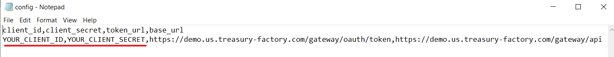

# Export_Third_Parties


## Requirements

Opening .ipynb files requires:
1. Google account
2. [Google Colaboratory][1]

[1]: https://workspace.google.com/marketplace/app/colaboratory/1014160490159?pann=ogb


## Installation

1.  Copy the repository link, open Command Prompt, go to the location where file will be copied and execute git clone command:

```shell
git clone https://github.com/OlhaLevko/Third-parties-exporting.git
```

2. Import Third_parties_exporting.ipynb file into your Google Drive.

3. Open config.csv file and input your client credentials by replacing the highlighted items with your client_id and client_secret, separated by the coma. Config file should look like this:



4. Open the jupyter notebook with Google Collab.

5. In the left menu open Files ,  find 'content' folder and upload config.csv file into this folder.

6. In the 8th cell choose the option in which format a report will be retrieved. It can be csv, json or both.

7. Run application. You can run the whole application: Runtime -> Run all, or execute separated cells.

8. Find the generated token under the 7th cell and the exported results under the 8th.

> ⚠️  _Please notice that Python is script language and code will be executed row by row or in the order you will run the cells._
